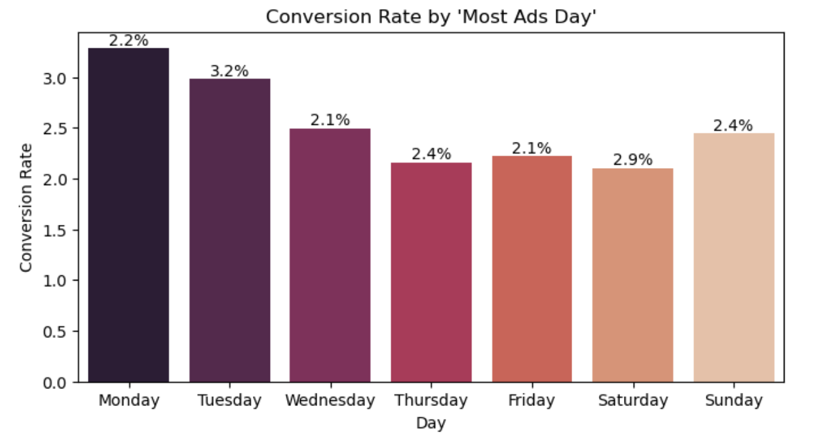
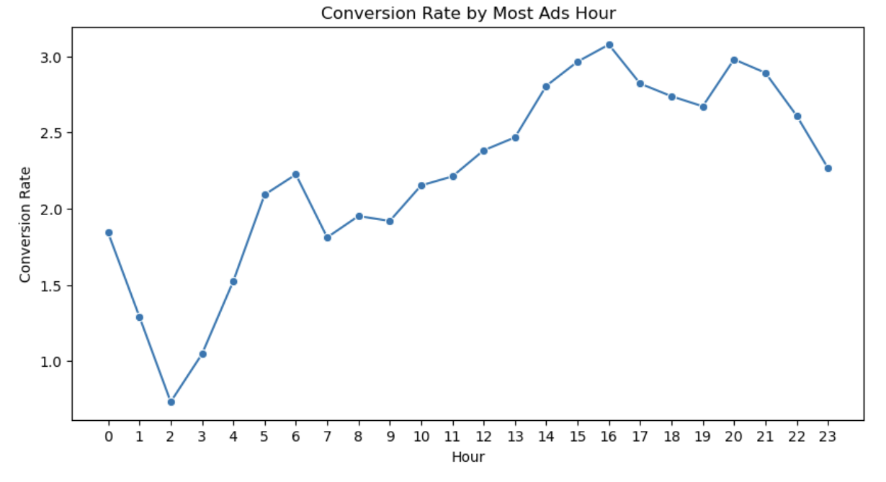

## Data Science, Machine Learning, NLP Projects 

---

#### Marketing Analysis - A/B Testing Project

This project involved conducting a detailed marketing analysis using A/B testing to measure the effectiveness of different marketing strategies. By analyzing customer engagement metrics, I provided actionable insights to optimize campaign performance. The results revealed a significant 15% increase in conversion rates for the optimized strategy, driving overall business growth.

[View project on GitHub](https://github.com/athk13/Marketing-Analysis-AB-Testing)

  

    
<strong>Figure 1:</strong> Conversion Rate by Day

    
  

  

    
<strong>Figure 2:</strong> Conversion Rates by Test Group

    
  

  

    
<strong>Figure 3:</strong> Conversion Rate by Hour

    
  

---
#### ML Models for Quantitative Finance- Alpha Research

At Optimas Capital, a distinguished investment management firm, I analyzed a complex dataset with over 2000 financial features using PCA and machine learning models like Random Forest and XGBoost, developing strategies that outperformed the market benchmark by 17.8%. Our team successfully achieved the project goal of finding orthogonal alphas.

[View project on GitHub](https://github.com/athk13/Quantitative-Finance-ML-Model)

---
#### Sentiment Analysis- Forex Trading Strategy

In this project, I developed a Forex trading strategy by conducting sentiment analysis on economic news extracted using the NY Times API, spanning 2003 to 2024, using advanced NLP techniques and machine learning algorithms. The strategy was optimized through backtesting and hyperparameter tuning, ultimately achieving a 1.4% annualized return, thereby outperforming the HFRI Currency Index. 

[View project on GitHub](https://github.com/athk13/FX-Sentiment-Analysis-Trading-Strategy)

  

    
<strong>Figure 1:</strong> Trading Signal Chart

    
  

  

    
<strong>Figure 2:</strong> Strategy Equity Curve

    
  

---

#### Deep NLP- Hate Speech Recognition

This project involves developing a machine learning model to detect hateful and offensive speech on social media platforms, specifically analyzing tweets from the 2020 US Elections. Using BERT, a natural language processing model, the project integrates both textual content and contextual stances towards political figures to classify tweets as either hateful or non-hateful, aiming to enhance content moderation by improving the detection accuracy of harmful online behavior.

[View project on Colab](https://colab.research.google.com/drive/1rRiavPZYeSQPbQE0IoRFXuawqtjPFXta?usp=sharing) | [View article on Medium](https://anshrutathakur13.medium.com/decoding-discord-using-ai-to-identify-hate-speech-100e8073d3bf)

---

### Data Analytics

- **Executive Compensation Analytics (SEC PvP Disclosures)** :
  
  Dove into compensation data across 1,780 firms, uncovering critical patterns between executive pay and corporate 
  outcomes, driving strategic shifts in performance benchmarks.
- **Strategic Portfolio Optimization** :
  
  Developed a data-driven portfolio optimization model using historical stock data and Markowitz's optimization theory, 
  successfully creating risk-adjusted, diversified portfolios.
  
---

